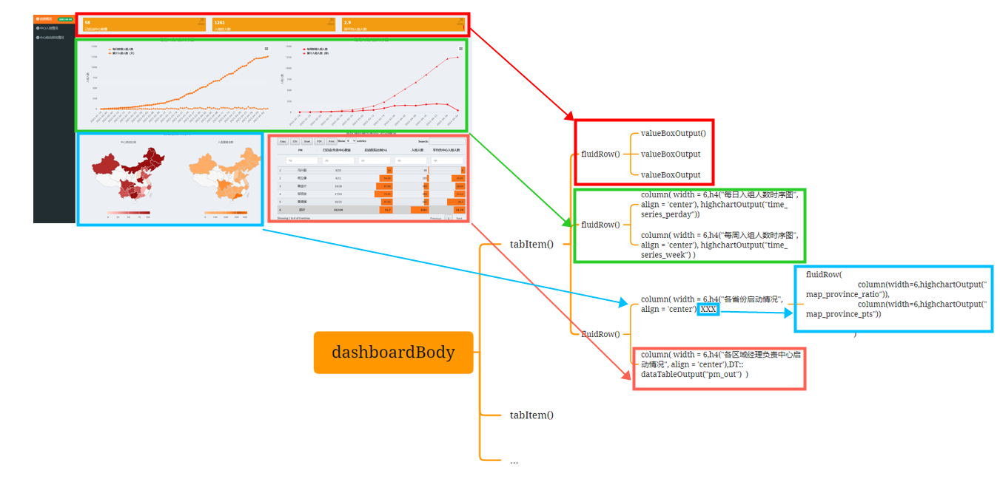
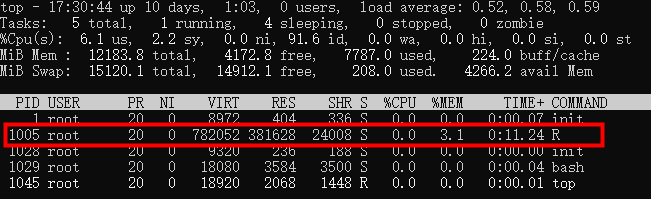

```{r setup, include=FALSE}
options(htmltools.dir.version = FALSE)
knitr::opts_chunk$set(
  fig.width=9, fig.height=3.5, fig.retina=3,
  out.width = "100%",
  cache = FALSE,
  echo = TRUE,
  message = FALSE, 
  warning = FALSE,
  hiline = TRUE
)
```

```{r xaringan-themer, include=FALSE, warning=FALSE}
library(xaringanthemer)
# style_duo_accent(
#   primary_color = "#006747",
#   secondary_color = "#FF961C",
#   inverse_header_color = "#FFFFFF"
# )

style_mono_light(
  base_color = "#1E6085"
  # outfile = xaringan_themer_css # omit in your slides to write the
  #                               # styles to xaringan-themer.css
)
```

## Elements

      
.pull-left[
### **helper.R**: 
- #### load libraries, 
- #### read data sets, 
- #### generate values, tables, plots
]


.pull-right[
### **ui.R** : 
- #### design layout of your dashboard  


### **server.R**: 
- #### render 
]

---
## ui.R

##### header+sidebar+body: `ui <- dashboardPage(header, sidebar, body )`

```{r eval=FALSE}
source('helper.R',encoding = 'utf-8')

header <- 
  dashboardHeader(title = HTML("Name of your dashboard"), 
                   disable = FALSE, 
                   titleWidth  = 520 ## change this 
                  )

sidebar <- 
  dashboardSidebar(
    width = 200,
    sidebarMenu(
      id = 'sidebar',
      style = "position: relative; overflow: visible;",
      
      menuItem("menu label 1", tabName = 'tab1', icon = icon('dashboard'),
               badgeLabel = latest_pts_date, badgeColor = "green" ),
      menuItem("menu label 2", tabName = 'tab2', icon = icon('dashboard'),
               badgeLabel = '', badgeColor = "green" )
    )
  )

```

---
## ui.R (cont'd)

```{r eval=FALSE}

body <- dashboardBody(
  ### tab1------
    tabItem( tabName = 'tab1',
      fluidRow(
        valueBoxOutput("enroll_hosp_tot_box")
      ),
      fluidRow( column( width = 6,h4("每日入组人数时序图", align = 'center'),
                        highchartOutput("time_series_perday"))
      ),
      fluidRow( column( width = 6,h4("各省份启动情况", align = 'center'), 
                        fluidRow(
                          column(width=6,highchartOutput("map_province_ratio")),
                          column(width=6,highchartOutput("map_province_pts"))
                        )
                        ),
                column( width = 6,h4("各区域经理负责中心启动情况", align = 'center'),DT::dataTableOutput("pm_out")  )
                )
    ),
  ###tab2---------
    tabItem( tabName = 'tab2',## place holder
            ) 
  )
    

```

---
## ui layout
 

---
## server.R

```{r eval=FALSE}
server <- 
  function(input, output, session) {
    
    ### 1. overall-----------
    output$enroll_tot_box <- renderValueBox({
      valueBox(
        VB_style(enroll_tot , "font-size: 60%;"  ),"入组总人数", icon = icon('export', lib = 'glyphicon'),
        color = "yellow"
      )
    })
    output$time_series_perday <- renderHighchart({p_time_series_cumday})
    output$top10_time_series <- renderPlotly({ ggplotly(p_top10_time_series,height = 400,width = 800)  })
    output$dy_rank <- renderUI({ p_dynamic_plot})
    output$pm_out <- DT::renderDataTable({
      DT::datatable(pm11, filter='top', editable = 'cell',extensions = 'Buttons',
                    options = list(dom = 'Blfrtip',
                                   scrollX = TRUE,
                                   scrollY = TRUE,
                                   buttons = c('copy', 'csv', 'excel', 'pdf', 'print'),
                                   lengthMenu = list(c(nrow(pm11),25,50,100,-1),
                                                     c(nrow(pm11),25,50,100,"All")),
                                   columnDefs = list(list(className = 'dt-center', targets = c(1,2))),
                                   columnDefs = list(list(className = 'dt-left', targets = c(3:5)))
                                   
                                   )) %>% 
      formatStyle(columns = 'PM', target = 'row', 
                  fontWeight = styleEqual(c('总计'), c('bold')),
                  backgroundColor = styleEqual(c('总计'), c('lightgrey'))) %>% 
      formatStyle(
        c('启动医院比例(%)'),
        background = styleColorBar( c(0,max(pm11$`启动医院比例(%)`)*2) , '#ff7518'),
        backgroundSize = '100% 90%',
        backgroundRepeat = 'no-repeat',
        backgroundPosition = 'center'
      ) %>% 
        formatStyle(
          c( '入组人数'),
          background = styleColorBar( c(0,max(pm11$入组人数)*2) , '#ff7518'),
          backgroundSize = '100% 90%',
          backgroundRepeat = 'no-repeat',
          backgroundPosition = 'center'
        )%>% 
        formatStyle(
          c( '平均各中心入组人数'),
          background = styleColorBar( c(0,max(pm11$平均各中心入组人数)*2) , '#ff7518'),
          backgroundSize = '100% 90%',
          backgroundRepeat = 'no-repeat',
          backgroundPosition = 'center'
        )
                                                     
    })
  }

```

---
## host app


#### Ubuntu: 
> 1. change work directory: `cd "/mnt/e/2023/0324asthma registry/asthmaapp0417"`    
> 2. show current work: `top`   
  

> 3. stop R work (if necessary): kill
> 4. run the app: `nohup  R -e 'shiny::runApp(host = getOption("shiny.host", "0.0.0.0"),port = 1017)' > /mnt/e/2023/0324asthma registry/asthmaapp0417/asthma_app_out.log 0>&1 &`

---
## Resources
### 1. [colorful R  palette](https://r-charts.com/color-palettes/)
### 2. [Map data](https://code.highcharts.com/mapdata/countries/cn/custom/cn-all-sar-taiwan.geo.json)
### 3. [plotly](https://plotly.com/graphing-libraries/)
### 4. [DT](https://rstudio.github.io/DT/shiny.html)
### 5. [highchart](https://www.highcharts.com/blog/tutorials/highcharts-for-r-users/)

---
class: center, middle

# Thanks!


